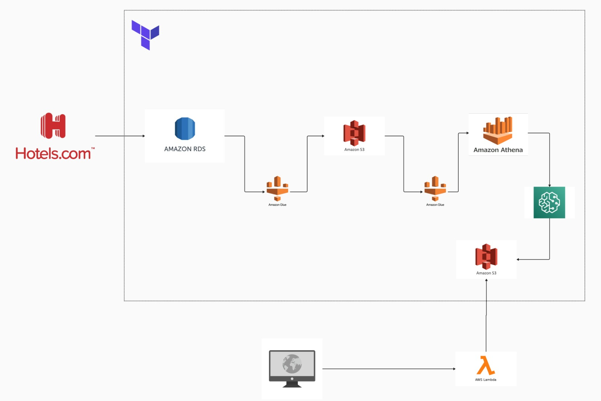

# Data Pipeline Architecture for Hotels.com

This repository provides an overview of the data pipeline architecture for processing and analyzing data from Hotels.com using various AWS services. The architecture leverages Amazon RDS, S3, Glue, Athena, and other AWS services to create a robust, scalable, and efficient data processing pipeline.

## Architecture Overview

### Components

1. *Hotels.com*
   - The data source for the pipeline, providing various datasets related to hotel bookings, customer reviews, and more.

2. *Amazon RDS (Relational Database Service)*
   - The initial storage for raw data received from Hotels.com.
   - Stores structured data in a relational database format.

3. *Amazon S3 (Simple Storage Service)*
   - Serves as a data lake, storing raw, processed, and transformed data.
   - Provides scalable storage for data in various formats (e.g., CSV, JSON, Parquet).

4. *Amazon Glue*
   - ETL (Extract, Transform, Load) service that processes data from Amazon RDS and Amazon S3.
   - Performs data cleaning, transformation, and cataloging.
   - Creates metadata catalog in AWS Glue Data Catalog for data stored in S3.

5. *Amazon Athena*
   - An interactive query service that allows SQL queries on data stored in Amazon S3.
   - Leverages the AWS Glue Data Catalog for schema information.
   - Enables easy and fast querying of large datasets without the need for complex ETL jobs.

6. *Amazon SageMaker*
   - A machine learning service to build, train, and deploy ML models.
   - Utilizes the data processed and queried through Athena for training models and making predictions.
   - Stores results and models back in Amazon S3 for further use.

7. *AWS Lambda*
   - A serverless compute service that automates various tasks in the pipeline.
   - Triggers ETL jobs, data transfers, and other processes based on predefined events.

8. *Terraform*
   - Infrastructure as Code (IaC) tool used to provision and manage AWS resources.
   - Ensures reproducibility and scalability of the infrastructure.

### Data Flow

1. Data from Hotels.com is ingested into Amazon RDS.
2. Amazon Glue extracts data from RDS, transforms it, and loads it into Amazon S3.
3. The transformed data in S3 is cataloged by AWS Glue for easy access.
4. Amazon Athena queries the cataloged data in S3, allowing for interactive SQL queries.
5. Amazon SageMaker utilizes the data queried by Athena for building and training ML models.
6. Trained models and predictions are stored back in Amazon S3.
7. AWS Lambda automates the entire pipeline, triggering processes based on events (e.g., new data arrival).

### Usage

To deploy this architecture, follow the steps below:

1. *Clone the Repository*
   sh
   git clone https://github.com/XoCedillo/mlops-team10
   cd yourrepository
   

2. *Set Up AWS Credentials*
   Ensure you have the necessary AWS credentials configured on your local machine or CI/CD pipeline.

3. *Provision Infrastructure*
   Use Terraform to deploy the infrastructure:
   sh
   terraform init
   terraform apply
   

4. *Ingest Data*
   Load your data from Hotels.com into Amazon RDS as per the defined schema.

5. *Trigger the Pipeline*
   AWS Lambda will automatically trigger the ETL jobs and other processes based on events.

6. *Query Data*
   Use Amazon Athena to run SQL queries on your data stored in S3.

7. *Build ML Models*
   Utilize Amazon SageMaker for building, training, and deploying machine learning models.

### Contributing

Feel free to contribute to this repository by submitting pull requests or opening issues for any enhancements or bug fixes.

### License

This project is licensed under the MIT License. See the LICENSE file for more details.

[def]: architecture/architecture.jpeg